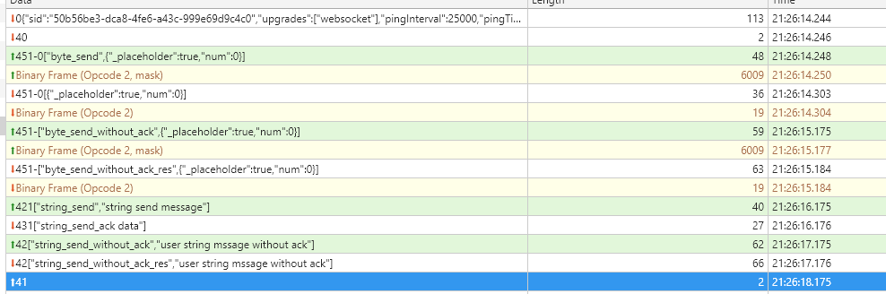

# 简介

本项目是一个将netty.socket.io与protobuf结合起来的demo工程。socket_client包含的是socket.io的js客户端。socket.server包含socket.io的web端。

# 组件介绍

前端使用https://github.com/dcodeIO/ProtoBuf.js 项目作为解析protobuf的工具；

使用https://github.com/mrniko/netty-socketio提供的工具访问socket.io协议。

#socket_server java实现的socketio服务端

需要先编译protobuf协议，然后启动App.java

#socket_client js实现的socketio客户端

直接打开index.html页面，chrome打开本地index.html打开时需要配置参数 --allow-file-access-from-files ,以支持本地跨域。

#socketio_connect_and_close.jpg 展示socket协议建立连接到关闭连接的过程

# socket io协议过程

先阅读websocket协议， 然后参考engineio协议https://github.com/socketio/engine.io-protocol，参考socketio协议https://github.com/socketio/socket.io-protocol

下面简单描述socketio协议过程：

socketio 支持三者模式， websocket ，polling，ajax 。

以下是socketio（websocket模式）整个通讯的过程：

1  客户端发起socketio连接

2  tcp三次握手建立连接

3  websocket协议建立连接（特定的http协议，一次http请求，一次http响应，这里不展开）

4  engine.io建立连接，服务器返回一个websocket帧,附带的值为（0{"sid":"50b56be3-dca8-4fe6-a43c-999e69d9c4c0","upgrades":["websocket"],"pingInterval":25000,"pingTimeout":60000}）

5  socketio建立连接，服务器返回websocket帧，附带值40

6  客户端可以传输非二进制事件并且要求立即响应，格式为

   420["string_send","string send message"]

   4是engineio的消息，2表示socketio的非二进制事件，0表示消息的id，递增，响应时要一一对应上。["string_send","string send message"]表示数组，第一个值是事件id，后面是事件的参数

   服务器可以响应非二进制事件，格式为

   430["string_send_ack data"]

   4是engineio的消息，3表示socketio的非二进制响应，0表示消息的id，递增，对应发送的消息。["string_send_ack data"]表示数组，响应的数据

   传输非二进制不要求立即响应事件，格式为

   42["string_send","string send message"]

   4是engineio的消息，2表示socketio的非二进制事件。["string_send","string send message"]表示数组，第一个值是事件id，后面是事件的参数

   二进制事件有两个websocket帧：

   二进制非立即响应事件，格式为
   第一帧：

   451-["byte_send_without_ack",{"_placeholder":true,"num":0}]

   4是engineio的消息，51-表示socketio的二进制事件。["byte_send_without_ack",{"_placeholder":true,"num":0}]数组第一个参数是事件id，后面是固定值

   第二帧：

   二进制数据

   二进制立即响应事件，格式为
   第一帧为：
   451-2["byte_send_without_ack",{"_placeholder":true,"num":0}]

   比上面多了2表示事件的id

7  socketio断开连接（websocket帧，41）

8  websocket帧，值为2表示websocket的ping，值为3表示websocket的pong

9  engine断开连接，websocket帧1

10 tcp断开连接